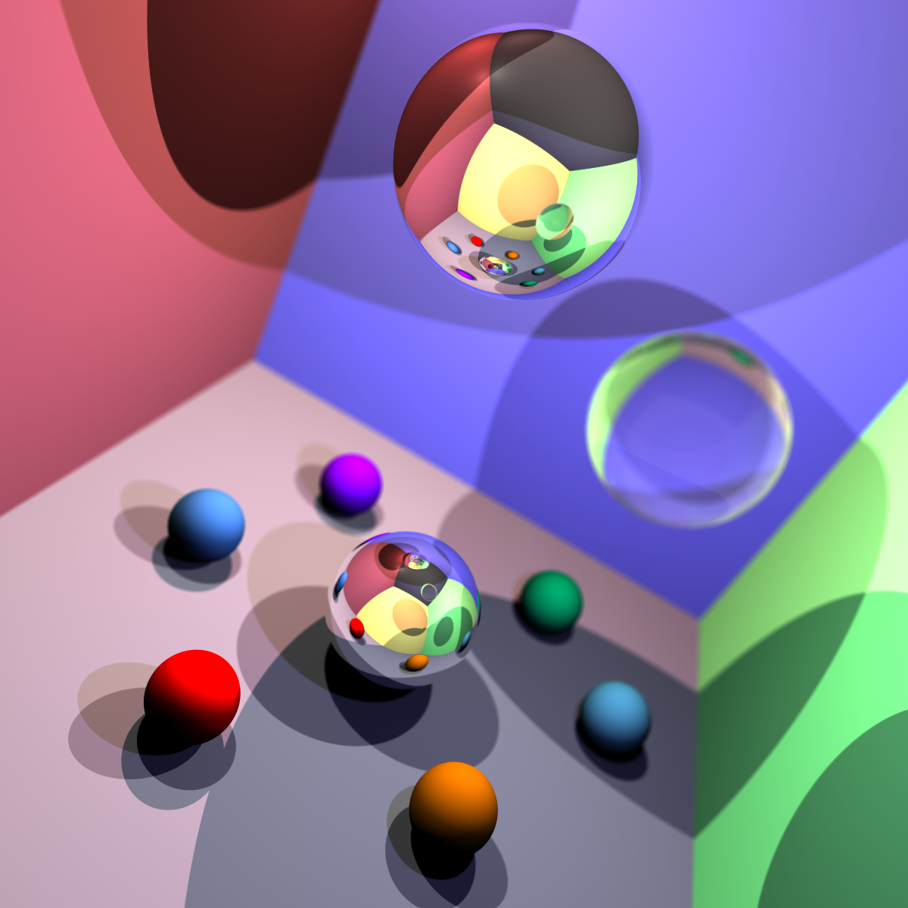

## Grading Report

**Final Grade:** 28.5
**Additional Comments:** -

7:52:24 PM: Building project C:\Users\Alex\Documents\GitHub\Project-1-Auto-Test\projects\jayden-woo
7:52:25 PM: STDOUT:

Microsoft (R) Build Engine version 16.10.2+857e5a733 for .NET
Copyright (C) Microsoft Corporation. All rights reserved.

Determining projects to restore...
Restored C:\Users\Alex\Documents\GitHub\Project-1-Auto-Test\projects\jayden-woo\RayTracer.csproj (in 121 ms).
RayTracer -> C:\Users\Alex\Documents\GitHub\Project-1-Auto-Test\projects\jayden-woo\report\bin\RayTracer.dll

Build succeeded.
0 Warning(s)
0 Error(s)

Time Elapsed 00:00:01.03
7:52:25 PM: Success building project.

### Stage 1

7:52:25 PM: Running test: 1*1_camera @ tests\Stage_1\1_1_camera~30s~-w_400*-h_300.txt
7:52:25 PM: Iteration timeout: 30 seconds
7:52:25 PM: Additional args: -w 400 -h 300
7:52:25 PM: Render completed in **0.19 seconds** user processor time (raw = 0.19s).

7:52:25 PM: Running test: 1_2_primitives @ tests\Stage_1\1_2_primitives~30s.txt
7:52:25 PM: Iteration timeout: 30 seconds
7:52:25 PM: Additional args: none
7:52:26 PM: Render completed in **0.3 seconds** user processor time (raw = 0.3s).

7:52:26 PM: Running test: 1_3_depth @ tests\Stage_1\1_3_depth~30s.txt
7:52:26 PM: Iteration timeout: 30 seconds
7:52:26 PM: Additional args: none
7:52:26 PM: Render completed in **0.33 seconds** user processor time (raw = 0.33s).

### Stage 1 Rubric

---

- [x] Stage Attempted (+12 marks)

---

- [ ] Camera - FOV Incorrect (-1 marks)
- [ ] Camera - Aspect Ratio Incorrect (-1 marks)
- [ ] Camera - Other Issue (minor) (-0.5 marks)
- [ ] Camera - Other Issue (major) (-1 marks)

---

- [ ] Shape - Plane Incorrect (-1 marks)
- [ ] Shape - Triangle Incorrect (-1 marks)
- [ ] Shape - Sphere Incorrect (-1 marks)
- [ ] Shape - Other Issue (minor) (-0.5 marks)
- [ ] Shape - Other Issue (major) (-1 marks)

---

- [ ] Depth - Wrong Order (1 case) (-1 marks)
- [ ] Depth - Wrong Order (2+ cases) (-2 marks)
- [ ] Depth - Other Issue (minor) (-0.5 marks)
- [ ] Depth - Other Issue (major) (-1 marks)

---

- [ ] Colour - Wrong Colour (1 case) (-1 marks)
- [ ] Colour - Wrong Colour (2+ cases) (-2 marks)
- [ ] Colour - Other Issue (minor) (-0.5 marks)
- [ ] Colour - Other Issue (major) (-1 marks)

---

- [ ] Other Issue #1 (major) (-1 marks)
- [ ] Other Issue #2 (major) (-1 marks)
- [ ] Other Issue #3 (minor) (-0.5 marks)
- [ ] Other Issue #4 (minor) (-0.5 marks)

---

**Additional Comments:** -

---

### Stage 2

7:52:26 PM: Running test: 2_1_diffuse @ tests\Stage_2\2_1_diffuse~60s.txt
7:52:26 PM: Iteration timeout: 60 seconds
7:52:26 PM: Additional args: none
7:52:27 PM: Render completed in **0.28 seconds** user processor time (raw = 0.28s).

7:52:27 PM: Running test: 2_2_reflection @ tests\Stage_2\2_2_reflection~60s.txt
7:52:27 PM: Iteration timeout: 60 seconds
7:52:27 PM: Additional args: none
7:52:27 PM: Render completed in **0.28 seconds** user processor time (raw = 0.28s).

7:52:27 PM: Running test: 2_3_refraction @ tests\Stage_2\2_3_refraction~300s.txt
7:52:27 PM: Iteration timeout: 300 seconds
7:52:27 PM: Additional args: none
7:52:28 PM: Render completed in **1.44 seconds** user processor time (raw = 1.44s).

7:52:28 PM: Running test: 2_4_sample @ tests\Stage_2\2_4_sample~300s~-x_3.txt
7:52:28 PM: Iteration timeout: 300 seconds
7:52:28 PM: Additional args: -x 3
7:52:35 PM: Render completed in **6.2 seconds** user processor time (raw = 6.2s).

### Stage 2 Rubric

---

- [x] Stage Attempted (+9 marks)

---

- [ ] Diffuse Light - No Output (-1 marks)
- [ ] Diffuse Light - Incorrect Equation/Normals (-1 marks)
- [ ] Diffuse Light - Other Issue (major) (-1 marks)
- [ ] Diffuse Light - Other Issue (minor) (-0.5 marks)

---

- [ ] Shadows - No Output (-1 marks)
- [ ] Shadows - Multiple Light Issues (-0.5 marks)
- [ ] Shadows - Other Issue (major) (-1 marks)
- [ ] Shadows - Other Issue (minor) (-0.5 marks)

---

- [ ] Reflection - No Output (-2 marks)
- [ ] Reflection - Partial Output (-1 marks)
- [ ] Reflection - Reflecting Refraction Issue (major) (-1 marks)
- [ ] Reflection - Reflecting Refraction Issue (minor) (-0.5 marks)
- [ ] Reflection - Other Issue (major) (-1 marks)
- [ ] Reflection - Other Issue (minor) (-0.5 marks)

---

- [ ] Refraction - No Output (-2 marks)
- [ ] Refraction - Partial Output (-1 marks)
- [ ] Refraction - Recursivity Issue(s) (-0.5 marks)
- [ ] Refraction - Non-Sphere Issue(s) (-0.5 marks)
- [ ] Refraction - Other Issue (major) (-1 marks)
- [x] Refraction - Other Issue (minor) (-0.5 marks)

---

- [ ] Fresnel - No Output (-2 marks)
- [ ] Fresnel - Angle of Incidence Issue (-1 marks)
- [ ] Fresnel - Minor Artefact (-0.5 marks)
- [ ] Fresnel - Major Artefact (-1 marks)

---

- [ ] Anti-aliasing - No Output (-1 marks)
- [ ] Anti-aliasing - Minor Artefact (-0.5 marks)
- [ ] Anti-aliasing - Major Artefact (-1 marks)

---

- [ ] Other Issue #1 (major) (-1 marks)
- [ ] Other Issue #2 (major) (-1 marks)
- [ ] Other Issue #3 (minor) (-0.5 marks)
- [ ] Other Issue #4 (minor) (-0.5 marks)

---

**Additional Comments:** -

---

### Stage 3A

7:52:35 PM: Running test: 3A_1_baseline @ tests\Stage_3A\3A_1_baseline~60s.txt
7:52:35 PM: Iteration timeout: 60 seconds
7:52:35 PM: Additional args: none
7:52:35 PM: Render completed in **0.28 seconds** user processor time (raw = 0.28s).

7:52:35 PM: Running test: 3A_2_emissive_low @ tests\Stage_3A\3A_2_emissive_low~1800s.txt
7:52:35 PM: Iteration timeout: 1800 seconds
7:52:35 PM: Additional args: none
7:52:35 PM: Render completed in **0.25 seconds** user processor time (raw = 0.25s).

7:52:35 PM: Running test: 3A_3_emissive_med @ tests\Stage_3A\3A_3_emissive_med~1800s.txt
7:52:35 PM: Iteration timeout: 1800 seconds
7:52:35 PM: Additional args: none
7:52:36 PM: Render completed in **0.25 seconds** user processor time (raw = 0.25s).

7:52:36 PM: Running test: 3A_4_emissive_high @ tests\Stage_3A\3A_4_emissive_high~1800s.txt
7:52:36 PM: Iteration timeout: 1800 seconds
7:52:36 PM: Additional args: none
7:52:36 PM: Render completed in **0.23 seconds** user processor time (raw = 0.23s).

### Stage 3A Rubric

---

- [ ] Stage Attempted (+6 marks)

---

- [ ] Source - Invisible (-1 marks)
- [ ] Source - Emission Colour Incorrect (-1 marks)
- [ ] Source - Material Colour Incorrect (-1 marks)
- [ ] Source - Material Receives Illumination (-1 marks)
- [ ] Source - Other Issue (major) (-1 marks)
- [ ] Source - Other Issue (minor) (-0.5 marks)

---

- [ ] Soft Shadows - Not Present (all cases) (-5 marks)
- [ ] Soft Shadows - Not Present (one+ case) (-2 marks)
- [ ] Soft Shadows - Major Issue (-2 marks)
- [ ] Soft Shadows - Minor Issue (-1 marks)

---

- [ ] Noise - Incomprehensible Image (-6 marks)
- [ ] Noise - Not Justified (-2 marks)
- [ ] Noise - Partially Justified (-1 marks)

---

- [ ] Time - Complete Timeout (-6 marks)
- [ ] Time - Not Justified (-2 marks)
- [ ] Time - Partially Justified (-1 marks)

---

- [ ] Other Issue #1 (major) (-1 marks)
- [ ] Other Issue #2 (major) (-1 marks)
- [ ] Other Issue #3 (minor) (-0.5 marks)
- [ ] Other Issue #4 (minor) (-0.5 marks)

---

**Additional Comments:** -

---

### Stage 3B

7:52:36 PM: Running test: 3B_1_ambient @ tests\Stage_3B\3B_1_ambient~3600s~-l.txt
7:52:36 PM: Iteration timeout: 3600 seconds
7:52:36 PM: Additional args: -l
7:52:36 PM: Render completed in **0.3 seconds** user processor time (raw = 0.3s).

### Stage 3B Rubric

---

- [ ] Stage Attempted (+6 marks)

---

- [ ] Indirect Light - None (-6 marks)
- [ ] Indirect Light - Partial or Unrealistic (-3 marks)
- [ ] Indirect Light - Incorrect Colour(s) (-2 marks)
- [ ] Indirect Light - Other Issue (major) (-1 marks)
- [ ] Indirect Light - Other Issue (minor) (-0.5 marks)

---

- [ ] Noise - Incomprehensible Image (-6 marks)
- [ ] Noise - Not Justified (-2 marks)
- [ ] Noise - Partially Justified (-1 marks)

---

- [ ] Time - Complete Timeout (-6 marks)
- [ ] Time - Not Justified (-2 marks)
- [ ] Time - Partially Justified (-1 marks)

---

- [ ] Other Issue #1 (major) (-1 marks)
- [ ] Other Issue #2 (major) (-1 marks)
- [ ] Other Issue #3 (minor) (-0.5 marks)
- [ ] Other Issue #4 (minor) (-0.5 marks)

---

**Additional Comments:** -

---

### Stage 3C

7:52:36 PM: Running test: 3C_1_baseline @ tests\Stage_3C\3C_1_baseline~1200s.txt
7:52:36 PM: Iteration timeout: 1200 seconds
7:52:36 PM: Additional args: none
7:52:37 PM: Render completed in **0.66 seconds** user processor time (raw = 0.66s).

7:52:37 PM: Running test: 3C_2_obj @ tests\Stage_3C\3C_2_obj~1200s.txt
7:52:37 PM: Iteration timeout: 1200 seconds
7:52:37 PM: Additional args: none
7:52:38 PM: Render completed in **0.66 seconds** user processor time (raw = 0.66s).

7:52:38 PM: Running test: 3C_3_obj @ tests\Stage_3C\3C_3_obj~1200s.txt
7:52:38 PM: Iteration timeout: 1200 seconds
7:52:38 PM: Additional args: none
7:52:38 PM: Render completed in **0.56 seconds** user processor time (raw = 0.56s).

### Stage 3C Rubric

---

- [ ] Stage Attempted (+6 marks)

---

- [ ] Shape - Not Visible (-6 marks)
- [ ] Shape - Major Artefact(s) (-2 marks)
- [ ] Shape - Minor Artefact(s) (-1 marks)
- [ ] Shape - RH Coordinate System (-0.5 marks)

---

- [ ] Lighting - Incorrect Normals (-2 marks)
- [ ] Lighting - Unsmoothed Normals (-1 marks)
- [ ] Lighting - Material Issue(s) (-1 marks)
- [ ] Lighting - Other Issue (minor) (-0.5 marks)
- [ ] Lighting - Other Issue (major) (-1 marks)

---

- [ ] Reflection - Major Artefact(s) (-2 marks)
- [ ] Reflection - Minor Artefact(s) (-1 marks)
- [ ] Reflection - Other Issue (minor) (-0.5 marks)
- [ ] Reflection - Other Issue (major) (-1 marks)

---

- [ ] Time - Bunny >5x Sphere (-0.5 marks)
- [ ] Time - Bunny >10x Sphere (-1 marks)
- [ ] Time - Bunny >25x Sphere (-2 marks)
- [ ] Time - Bunny >100x Sphere (or downscale) (-3 marks)
- [ ] Time - Complete Timeout (-6 marks)

---

- [ ] Other Issue #1 (major) (-1 marks)
- [ ] Other Issue #2 (major) (-1 marks)
- [ ] Other Issue #3 (minor) (-0.5 marks)
- [ ] Other Issue #4 (minor) (-0.5 marks)

---

**Additional Comments:** -

---

### Stage 3D

7:52:38 PM: Running test: 3D_1_glossy @ tests\Stage_3D\3D_1_glossy~1800s.txt
7:52:38 PM: Iteration timeout: 1800 seconds
7:52:38 PM: Additional args: none
7:52:39 PM: Render completed in **0.63 seconds** user processor time (raw = 0.63s).

### Stage 3D Rubric

---

- [ ] Stage Attempted (+3 marks)

---

- [ ] Effect - Not Visible (-3 marks)
- [ ] Effect - Unconvincing (-2 marks)
- [ ] Effect - Partially convincing (-1 marks)
- [ ] Effect - Minor Issue/Artefact(s) (-0.5 marks)

---

- [ ] Technique - Overly Simple (-1 marks)
- [ ] Technique - Minor Issue (-0.5 marks)
- [ ] Technique - Major Issue (-1 marks)

---

- [ ] Time - Complete Timeout (-3 marks)
- [ ] Time - Not Justified (-2 marks)
- [ ] Time - Partially Justified (-1 marks)

---

- [ ] Other Issue #1 (major) (-1 marks)
- [ ] Other Issue #2 (major) (-1 marks)
- [ ] Other Issue #3 (minor) (-0.5 marks)
- [ ] Other Issue #4 (minor) (-0.5 marks)

---

**Additional Comments:** -

---

### Stage 3E

7:52:39 PM: Running test: 3E*1_camera @ tests\Stage_3E\3E_1_camera~30s~--cam-pos_0,2,-0.5*--cam-axis*1,0,0*--cam-angle_45.txt
7:52:39 PM: Iteration timeout: 30 seconds
7:52:39 PM: Additional args: --cam-pos 0,2,-0.5 --cam-axis 1,0,0 --cam-angle 45
7:52:39 PM: Render completed in **0.25 seconds** user processor time (raw = 0.25s).

7:52:39 PM: Running test: 3E*2_camera @ tests\Stage_3E\3E_2_camera~30s~--cam-pos_0,2,-0.5*--cam-axis*1,0,0*--cam-angle\_-45.txt
7:52:39 PM: Iteration timeout: 30 seconds
7:52:39 PM: Additional args: --cam-pos 0,2,-0.5 --cam-axis 1,0,0 --cam-angle -45
7:52:40 PM: Render completed in **0.31 seconds** user processor time (raw = 0.31s).

7:52:40 PM: Running test: 3E*3_camera @ tests\Stage_3E\3E_3_camera~30s~--cam-pos_0,0,-1*--cam-axis*0,0.707,0.707*--cam-angle_20.txt
7:52:40 PM: Iteration timeout: 30 seconds
7:52:40 PM: Additional args: --cam-pos 0,0,-1 --cam-axis 0,0.707,0.707 --cam-angle 20
7:52:40 PM: Render completed in **0.25 seconds** user processor time (raw = 0.25s).

### Stage 3E Rubric

---

- [x] Stage Attempted (+3 marks)

---

- [ ] Position - Incorrect (1 case) (-1 marks)
- [ ] Position - Incorrect (2+ cases) (-2 marks)

---

- [x] Rotation - Wrong Angle (-1 marks)
- [ ] Rotation - Wrong Angle Direction (-1 marks)
- [ ] Rotation - Incorrect (1 case) (-1 marks)
- [ ] Rotation - Incorrect (2+ cases) (-2 marks)

---

- [ ] Time - Complete Timeout (-3 marks)
- [ ] Time - Not Justified (-2 marks)
- [ ] Time - Partially Justified (-1 marks)

---

- [ ] Other Issue #1 (major) (-1 marks)
- [ ] Other Issue #2 (major) (-1 marks)
- [ ] Other Issue #3 (minor) (-0.5 marks)
- [ ] Other Issue #4 (minor) (-0.5 marks)

---

**Additional Comments:** -

---

### Stage 3F

7:52:40 PM: Running test: 3F_1_beers_room @ tests\Stage_3F\3F_1_beers_room~120s.txt
7:52:40 PM: Iteration timeout: 120 seconds
7:52:40 PM: Additional args: none
7:52:42 PM: Render completed in **1.92 seconds** user processor time (raw = 1.92s).

7:52:42 PM: Running test: 3F_2_beers_pyramid @ tests\Stage_3F\3F_2_beers_pyramid~120s.txt
7:52:42 PM: Iteration timeout: 120 seconds
7:52:42 PM: Additional args: none
7:52:43 PM: Render completed in **0.98 seconds** user processor time (raw = 0.98s).

### Stage 3F Rubric

---

- [ ] Stage Attempted (+3 marks)

---

- [ ] Colour - No Change (-3 marks)
- [ ] Colour - Hue Incorrect (-1 marks)
- [ ] Colour - Blending Issue (minor) (-1 marks)
- [ ] Colour - Blending Issue (major) (-2 marks)
- [ ] Colour - Absorbance Issue (minor) (-1 marks)
- [ ] Colour - Absorbance Issue (major) (-2 marks)
- [ ] Colour - Other Issue (minor) (-0.5 marks)
- [ ] Colour - Other Issue (major) (-1 marks)

---

- [ ] Shape - Sphere Issue (-1 marks)
- [ ] Shape - Non-Sphere Issue (-1 marks)
- [ ] Shape - Other Issue (minor) (-0.5 marks)
- [ ] Shape - Other Issue (major) (-1 marks)

---

- [ ] Time - Complete Timeout (-3 marks)
- [ ] Time - Not Justified (-2 marks)
- [ ] Time - Partially Justified (-1 marks)

---

- [ ] Other Issue #1 (major) (-1 marks)
- [ ] Other Issue #2 (major) (-1 marks)
- [ ] Other Issue #3 (minor) (-0.5 marks)
- [ ] Other Issue #4 (minor) (-0.5 marks)

---

**Additional Comments:** -

---

### Stage 3G

7:52:43 PM: Running test: 3G*1_dof @ tests\Stage_3G\3G_1_dof~1800s~--aperture-radius_0.06*--focal-length_1.5.txt
7:52:43 PM: Iteration timeout: 1800 seconds
7:52:43 PM: Additional args: --aperture-radius 0.06 --focal-length 1.5
7:53:00 PM: Render completed in **17.06 seconds** user processor time (raw = 17.06s).

### Stage 3G Rubric

---

- [x] Stage Attempted (+3 marks)

---

- [ ] Aperture - None/Incomprehensible Output (-3 marks)
- [ ] Aperture - Incorrect Size (-1 marks)
- [ ] Aperture - Other Issue (major) (-1 marks)
- [ ] Aperture - Other Issue (minor) (-0.5 marks)

---

- [ ] Focal Length - Incorrect Distance (-1 marks)
- [ ] Focal Length - Other Issue (major) (-1 marks)
- [ ] Focal Length - Other Issue (minor) (-0.5 marks)

---

- [ ] Time - Complete Timeout (-3 marks)
- [ ] Time - Not Justified (-2 marks)
- [ ] Time - Partially Justified (-1 marks)

---

- [ ] Other Issue #1 (major) (-1 marks)
- [ ] Other Issue #2 (major) (-1 marks)
- [ ] Other Issue #3 (minor) (-0.5 marks)
- [ ] Other Issue #4 (minor) (-0.5 marks)

---

**Additional Comments:** -

---

### Stage Final

### Stage Final Rubric

---

- [x] Final Image Attempted (+3 marks)

---

- [ ] Coverage - Little/None (-1 marks)
- [ ] Coverage - Partial (-0.5 marks)

---

- [ ] Quality - Little/None (-1 marks)
- [ ] Quality - Partial (-0.5 marks)

---

- [ ] Creativity - Little/None (-1 marks)
- [ ] Creativity - Partial (-0.5 marks)

---

- [ ] Other - Repository Issue (minor) (-0.5 marks)
- [ ] Other - Repository Issue (major) (-1 marks)
- [ ] Other - README.md References Lacking (-1 marks)
- [ ] Other - README.md Utilised Incorrectly (-1 marks)
- [ ] Other - GitHub Not Utilised (-2 marks)
- [ ] Other - GitHub Incorrectly Utilised (-1 marks)

---

**Additional Comments:** -

---
